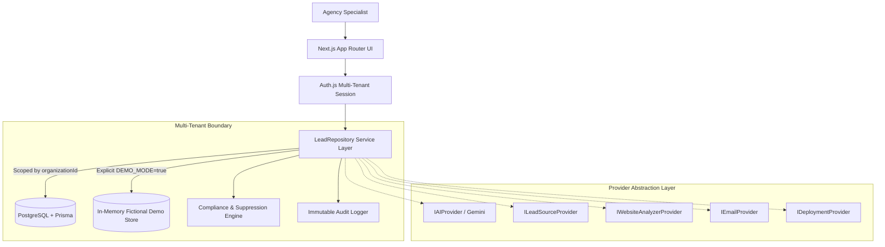

# LeadForge AI - System Architecture (Phase 1)

## Overview
LeadForge AI is a high-assurance, multi-tenant B2B SaaS designed specifically for website agencies targeting professional service firms (MVP niche: **Chartered Accountants in Gurgaon / Delhi NCR**).

The system addresses the core failure modes of conventional sales software: spam propagation, untargeted scraping, vendor lock-in, and unauthorized outreach.

---

## Architectural Principles

### 1. Explicit Tenancy Isolation
All models (`Lead`, `Contact`, `Website`, `Activity`, `AuditLog`, `ConsentRecord`, `SuppressionRecord`, `Job`) carry a required foreign key relation to `Organization`.
Isolation is enforced at the server query layer (`where: { organizationId: session.organizationId }`), ensuring tenant data can never bleed across organizational boundaries.

### 2. Explicit Demo Mode Switch
The application never silently serves fallback or simulated data when PostgreSQL fails in production:
- In production (`DEMO_MODE !== 'true'`), a database failure immediately yields an explicit `DatabaseConnectionError`.
- Only when `DEMO_MODE=true` is explicitly set in the environment will the sandbox repository load fictional records.
- All fictional records are strictly stamped with `isDemoData: true` and labeled `DEMO DATA` in the UI.

### 3. Decoupled Service Provider Abstraction
Business logic never binds directly to third-party SDKs:
- `IAIProvider`: Exclusively handles semantic reasoning (website interpretation, opportunity evaluation, pitch formulation). Basic DB operations (search, filter, sort, pagination, counts) are strictly deterministic and run on SQL/in-memory indices.
- `ILeadSourceProvider`: Interacts with authorized public registry APIs.
- `IWebsiteAnalyzerProvider`: Interfaces with Lighthouse/PageSpeed.
- `IEmailProvider`: Interacts with transactional email engines (Resend).
- `IDeploymentProvider`: Interacts with hosting infrastructure (Vercel/Cloudflare).

When any provider is not configured in production, it reports `"Provider not configured"`. It never fabricates simulated success.

### 4. Asynchronous Job Tracking
To prepare for long-running crawlers and site audits, the `Job` model tracks execution lifecycle (`QUEUED` → `RUNNING` → `COMPLETED` / `FAILED` / `CANCELLED`) with detailed metadata and progress metrics.
