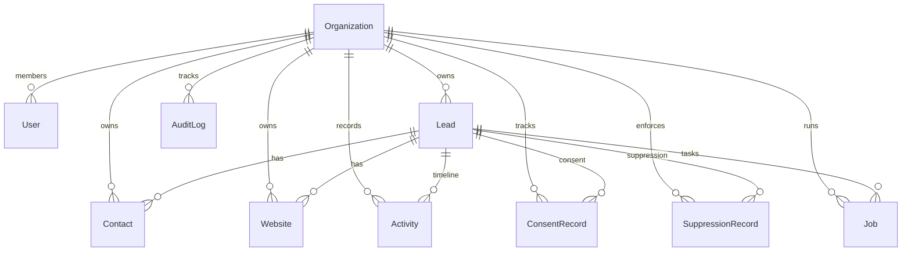

# Database Schema & Entity Documentation

The database schema is implemented with Prisma and PostgreSQL.

## Entity Relationship Overview

## Entity Details

### 1. `Organization`
The tenant boundary. All data queries are scoped by `organizationId`.
- `id` (String / CUID, Primary Key)
- `name` (String)
- `slug` (String, Unique)
- `domain` (String, Optional)
- `createdAt`, `updatedAt` (DateTime)

### 2. `User`
Authenticated agency staff member.
- `id`, `name`, `email` (Unique)
- `role` (`ADMIN` | `MEMBER`)
- `organizationId` (Foreign Key to `Organization`)

### 3. `Lead`
Core business entity representing an identified professional firm.
- `id` (String / CUID, Primary Key)
- `businessName` (String)
- `profession` (String, default "Chartered Accountant")
- `city` (String, default "Gurgaon")
- `address` (String)
- `website` (String, Optional)
- `publicEmail`, `publicPhone` (String, Optional)
- `source` (String), `sourceUrl` (String, Optional)
- `websiteStatus` (`NO_WEBSITE`, `OUTDATED`, `BROKEN_SSL`, `NOT_MOBILE_FRIENDLY`, `MODERN`)
- `leadStatus` (All 13 pipeline statuses)
- `opportunityScore` (Int 0-100)
- `opportunityReason` (Text)
- `isDemoData` (Boolean, default `false`)
- `organizationId` (Foreign Key to `Organization`)

### 4. `Contact`
Individual partner or manager at the business.
- `id`, `name`, `role`, `email`, `phone`
- `isPrimary` (Boolean)
- `linkedinUrl` (String, Optional)
- `leadId`, `organizationId`

### 5. `Website`
Technical audit snapshot for the firm's website.
- `url`, `status`, `cms`, `speedScore`, `mobileFriendly`, `hasSsl`, `auditNotes`
- `leadId`, `organizationId`

### 6. `Activity`
Chronological interaction and milestone log.
- `type` (`DISCOVERY`, `AUDIT`, `STATUS_CHANGE`, `NOTE`, etc.)
- `title`, `description`, `metadata`
- `leadId`, `userId`, `organizationId`

### 7. `AuditLog`
Immutable compliance and action log.
- `action` (Enum string: `LEAD_CREATED`, `LEAD_STATUS_CHANGED`, `LEAD_MARKED_DO_NOT_CONTACT`, etc.)
- `entity`, `entityId`, `actor`, `actorId`, `organizationId`, `details`

### 8. `ConsentRecord`
Explicit channel-level permissions.
- `leadId`, `organizationId`
- `channel` (`EMAIL`, `WHATSAPP`, `SMS`, `VOICE`)
- `status` (`UNKNOWN`, `PENDING`, `OPTED_IN`, `OPTED_OUT`, `EXPIRED`)
- `source`, `evidence`, `timestamp`, `expiresAt`

### 9. `SuppressionRecord`
Mandatory exclusion list entry.
- `leadId`, `organizationId`
- `channel` (`EMAIL`, `WHATSAPP`, `SMS`, `VOICE`)
- `reason`, `createdAt`, `createdBy`

### 10. `Job`
Asynchronous background task tracker.
- `type` (`LEAD_DISCOVERY`, `WEBSITE_ANALYSIS`, `AI_ANALYSIS`, `DEMO_GENERATION`, `OUTREACH_GENERATION`)
- `status` (`QUEUED`, `RUNNING`, `COMPLETED`, `FAILED`, `CANCELLED`)
- `progress` (Int 0-100), `error` (Text), `metadata` (JSON)
